# Project Architecture Schema

> Automatically generated by `.codex/skills/create-visual-schema/scripts/create-visual-schema.js` on 2026-05-24

## Legend

| Node | Meaning |
|---|---|
| 📋 index.md | Entry point — the AI reads it first |
| ⚙️ active_context | Operating core — current state and draft |
| 📜 manuscript | Final archive — read-only |
| 💾 draft_saves | Checkpoints — save/restore work |

## Diagram

```mermaid
flowchart TD

    %% -- CENTRAL NODE --
    INDEX["📋 00_meta/index.md\nProject map"]
    STATE["⚙️ 06_active_context/\ncurrent_state.json\n+ working_draft.md"]

    %% -- REPOSITORY --
    WORLD["🌍 01_world/\nLore · Magic · Factions"]
    CHARS["👤 02_characters/\nProfiles · relations.md"]
    LOCS["📍 03_locations/\nLocations · sensory details"]
    PLOT["📖 04_plot/\nOutline · Timeline · Chapters"]
    ITEMS["🗝️ 05_items/\nkey_items.md"]
    MANU["📜 07_manuscript/\nFinal text (read-only)"]
    SAVES["💾 draft_saves/\nContext saves"]

    %% -- MAIN DATA FLOW --
    INDEX --> STATE
    STATE --> MANU
    STATE <--> CHARS
    STATE <--> LOCS
    STATE <--> PLOT
    STATE --> SAVES
    SAVES --> STATE
    PLOT <--> ITEMS
    PLOT <--> WORLD

    %% -- SETUP & MAINTENANCE --
    subgraph GRP0["🛠 Setup & Maintenance"]
        direction TB
        SK_init_structure["/init-structure"]
        SK_reset_project["/reset-project"]
        SK_create_visual_schema["/create-visual-schema"]
    end

    %% -- CONTENT CREATION --
    subgraph GRP1["🛠 Content Creation"]
        direction TB
        SK_create_character["/create-character"]
        SK_create_location["/create-location"]
        SK_create_world["/create-world"]
    end

    %% -- CHAPTER MANAGEMENT --
    subgraph GRP2["🛠 Chapter Management"]
        direction TB
        SK_new_chapter["/new-chapter"]
        SK_change_scene["/change-scene"]
        SK_close_chapter["/close-chapter"]
        SK_save_context["/save-context"]
        SK_restore_context["/restore-context"]
    end

    %% -- ANALYSIS & UPDATES --
    subgraph GRP3["🛠 Analysis & Updates"]
        direction TB
        SK_analyze_chapter["/analyze-chapter"]
        SK_extract_from_manuscript["/extract-from-manuscript"]
        SK_extract_from_image["/extract-from-image"]
        SK_update_items["/update-items"]
        SK_update_relations["/update-relations"]
        SK_update_timeline["/update-timeline"]
    end

    %% -- REVIEW & VISUALIZATION --
    subgraph GRP4["🛠 Review & Visualization"]
        direction TB
        SK_review_draft["/review-draft"]
        SK_generate_gantt["/generate-gantt"]
    end

    %% -- SKILL CONNECTIONS --
    GRP0 --> INDEX
    GRP1 --> CHARS
    GRP1 --> LOCS
    GRP1 --> WORLD
    GRP2 --> STATE
    GRP3 --> PLOT
    GRP3 --> CHARS
    GRP3 --> ITEMS
    GRP4 --> PLOT
    GRP4 --> STATE

    %% -- STYLES --
    style INDEX fill:#4A90D9,color:#fff,stroke:#2c6aa0
    style STATE fill:#E8A838,color:#fff,stroke:#b07820
    style MANU  fill:#5cb85c,color:#fff,stroke:#3d8b3d
    style SAVES fill:#9B59B6,color:#fff,stroke:#6c3483
```

