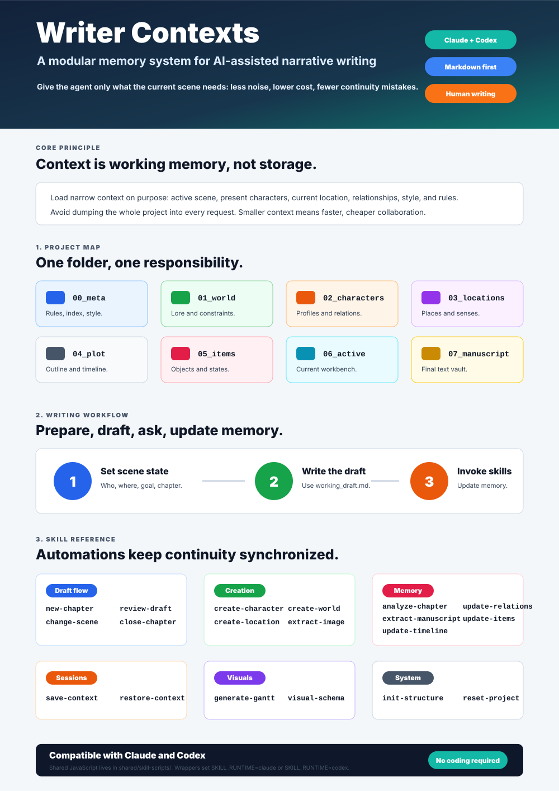

# AI Writing Context System

A modular context-management template for human writers using AI agents with Claude or Codex.

This project is not meant to automate storytelling or replace human authors. It is meant to help writers keep long-form narrative projects coherent while giving the AI agent only the context it actually needs.

Repository link: https://github.com/CMDR-Sigm4/writers_contexts

## Why This Exists

Context is not an infinite warehouse. It is the agent's working memory.

When an AI agent loads too much project material, the result is slower, more expensive, and less reliable. Cloud LLMs and APIs can become more costly because every unnecessary token matters. Local models can become impractical because very large context windows require large amounts of RAM.

In many agentic tools, even a simple greeting can start with tens of thousands of tokens already occupied by tools, permissions, project instructions, and runtime state. Buying a more expensive plan, increasing RAM, or relying on larger context windows should not be the first solution. Better context design should come first.

This system solves that by splitting a writing project into small, focused files and teaching the agent where to look.

## What It Does

Instead of asking the agent to read the whole project, the structure tells it to load only the relevant files:

- the active scene;
- the current characters;
- the current location;
- relevant relationships;
- relevant world rules;
- the chapter summary or timeline entries needed for continuity;
- project style and operational rules.

Used well, this can reduce the amount of context loaded for a single request by a large margin. Exact numbers depend on the project, but for medium or long narrative projects, loading a few targeted files instead of dumping the whole manuscript can often reduce active context by roughly 60-90%.

The main benefits are:

- lower token usage for cloud/API workflows;
- lower RAM pressure for local-model workflows;
- less irrelevant context noise;
- fewer continuity mistakes;
- lower hallucination risk;
- faster, more focused agent responses;
- clearer separation between human creative decisions and AI assistance.

For best results, start a fresh chat from time to time. The project memory lives in files, so the agent can reload the needed state through `00_meta/index.md`, `current_state.json`, summaries, timelines, and character files. If you keep one long conversation open forever, the chat history itself will keep filling the context window and eventually cancel out much of the benefit of this system.

## Project Structure

```text
00_meta/             Rules, project map, style reference, visual schema
01_world/            Worldbuilding, lore, institutions, constraints
02_characters/       Character sheets and relationship log
03_locations/        Location files and sensory details
04_plot/             Master outline, timeline, chapter summaries
05_items/            Important objects and state changes
06_active_context/   Current scene state and working draft
07_manuscript/       Final chapter text
.codex/              Codex skills and project config
.claude/             Claude skills and settings
shared/skill-scripts Shared JavaScript runtime used by both agents
```

The guiding principle is simple: one file per concept, one responsibility per folder.

## Claude And Codex Support

The project supports both Claude and Codex.

- Codex skills live in `.codex/skills/` and use hyphenated names, such as `new-chapter` and `reset-project`.
- Claude skills live in `.claude/skills/` and use legacy underscore names, such as `new_chapter` and `reset_project`.
- Shared JavaScript implementations live in `shared/skill-scripts/`.

The skill-specific scripts inside `.codex/skills/` and `.claude/skills/` are thin wrappers. They set a runtime flag before calling the shared implementation:

- `SKILL_RUNTIME=codex` for Codex;
- `SKILL_RUNTIME=claude` for Claude.

This allows one shared script to detect which environment launched it, while avoiding duplicated JavaScript logic.

The `shared/skill-scripts/` folder is system infrastructure. It must be preserved during resets, cleanup workflows, and skill migrations.

## Permissions

The repository includes explicit permission configuration for both environments.

Claude uses `.claude/settings.json`:

```json
{
  "permissions": {
    "allow": [
      "Read",
      "Edit",
      "Write",
      "Bash(node *)"
    ],
    "deny": [
      "Bash(curl *)",
      "Bash(wget *)",
      "Bash(npm *)",
      "Bash(pip *)",
      "Bash(git *)",
      "WebFetch",
      "WebSearch"
    ]
  }
}
```

Codex uses `.codex/config.toml`:

```toml
approval_policy = "on-request"
sandbox_mode = "workspace-write"

[sandbox_workspace_write]
network_access = false
```

These settings are not a substitute for judgment, but they provide a safer operating baseline: local project writes are expected, while network access and broader actions are constrained or require approval.

## Main Skills

The system includes reusable workflows for common writing operations:

- `new-chapter`: prepare a new chapter or writing session.
- `close-chapter`: archive the draft, create a summary, update timeline, relations, items, and outline.
- `change-scene`: update active characters, location, or scene goal.
- `create-character`: create a character sheet.
- `create-location`: create a location file.
- `create-world`: create a worldbuilding or lore file.
- `update-timeline`: update chronology without closing a chapter.
- `update-relations`: update relationship changes over time.
- `update-items`: track important objects, holders, and state changes.
- `review-draft`: critique the current draft without modifying it automatically.
- `extract-from-manuscript`: import structured context from an existing manuscript chapter.
- `extract-from-image`: use an image or visual reference to create or enrich project context.
- `create-visual-schema`: regenerate the Mermaid visual architecture guide.
- `reset-project`: remove demo narrative data and prepare the template for a new story.

## Automated Continuity Features

The most useful part of the system is not file organization by itself. It is the way skills keep project memory synchronized.

Examples:

- Closing a chapter creates an agent-facing summary.
- Timeline entries can track present events, flashbacks, flashforwards, branches, conditions, and first reveals.
- Relationship entries are chronological, so the agent can respect what characters know or feel at a specific chapter.
- Key items track holders, locations, destruction, retirement, and state changes.
- Image references can update character or location files and then propagate conflicting details into drafts, chapter summaries, timelines, style samples, and item lists.

This is especially useful for nonlinear stories, branching games, quest structures, and choice-driven narratives where consequences may depend on chronology, branch conditions, or relationship state.

## Guides

The repository includes:

- `USER_GUIDE.md`: practical text guide for human users;
- `VISUAL_USER_GUIDE.svg`: visual overview;
- `00_meta/architecture_schema.md`: Mermaid architecture schema.

Use the `create-visual-schema` skill when the structure changes and the Mermaid visual architecture guide needs to be regenerated. The text guide is kept current through the system maintenance rules.

## Demo Content

The included characters, story, locations, and objects are fictional demo data generated with AI for example purposes only.

They exist to show how the system works. The tool itself is designed to support human writing, not replace it.

## Starting A New Project

1. Clone or copy the repository.
2. Open it with Claude or Codex.
3. Read `USER_GUIDE.md`.
4. Run the reset skill to remove demo content:

   - Codex: invoke `reset-project`.
   - Claude: invoke `reset_project`.

The reset workflow requires double confirmation and preserves system infrastructure, including `.codex/`, `.claude/`, `shared/skill-scripts/`, rules, guides, and workflows.

After reset, use:

- `init-structure` to recreate any missing placeholders;
- `create-character`, `create-location`, and `create-world` to add project material;
- `new-chapter` to start writing.

During normal use, do not be afraid to start a new chat after major milestones: after closing a chapter, after a large refactor, after importing manuscript material, or whenever the conversation has become very long. The files are the durable memory; the chat is only the current working session.

## No Coding Required

Most of the value comes from plain text:

- Markdown files;
- project rules;
- skill instructions;
- character sheets;
- timelines;
- relationship logs;
- item logs;
- location files.

You do not need to be a software developer to adapt this system. Plain English, or your own native language is enough if the instructions are explicit.

The best advice is simple: do not be afraid to read the documentation. AI agents are not only for technical developers. They can be useful collaborators for writers, editors, narrative designers, worldbuilders, and game creators when the project gives them a clean memory to work with.


